---

title: "Microservices and Distributed Systems Design Patterns"
author: ""
date: "2025-05-16"
toc: true
toc-depth: 3
fontsize: 11pt
geometry: margin=1in
--------------------

# I. Microservices Design Patterns

Designing microservices isn’t just about breaking a system into smaller parts—it’s about doing so in a way that ensures scalability, resilience, and maintainability. As you, the architect, piece together a modern system, understanding and applying proven design patterns makes the difference between fragile services and battle-hardened infrastructure. The following microservices patterns address key concerns such as service coordination, fault tolerance, and system observability. Each one helps to tame the complexity inherent in distributed systems.

### Service Registry & Discovery

Solves dynamic service resolution by allowing services to register and discover each other at runtime.

When services scale up or down, their locations (IP addresses, ports) change frequently. Instead of hard-coding endpoints, use a registry system where each service registers its availability. Clients and other services query this registry to find live endpoints. Popular implementations include Netflix Eureka and HashiCorp Consul.

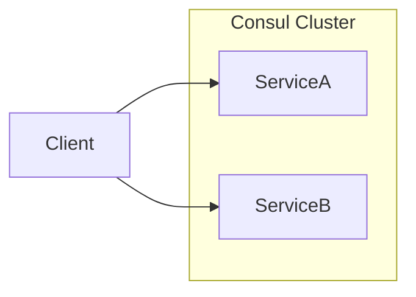

```java
@Bean
public RestTemplate loadBalanced() {
  return new RestTemplate();
}
```

**Key Benefits:**

* Supports dynamic scaling and resiliency
* Decouples service location logic from clients

**Potential Drawbacks / Considerations:**

* Registry availability becomes critical

{: #pattern-service-registry }

### API Gateway

Solves external client access management by routing requests through a central entry point.

Rather than exposing each microservice directly to clients, you place an API Gateway in front. It handles request routing, load balancing, authentication, and even rate limiting. It can aggregate responses from multiple services. Tools like Spring Cloud Gateway and Kong are commonly used.

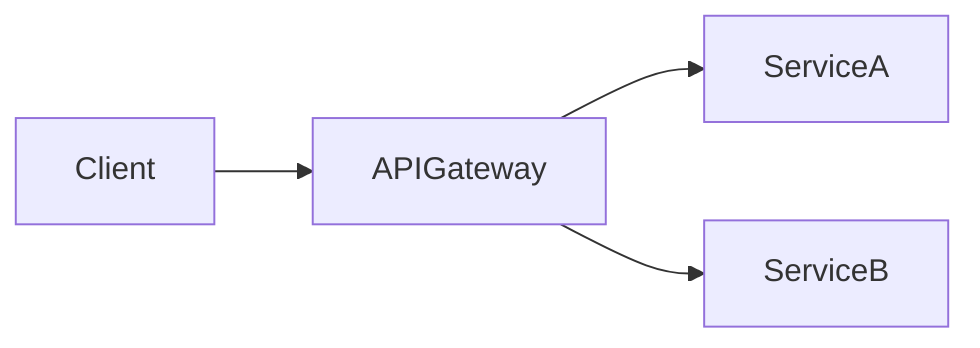

**Key Benefits:**

* Centralized authentication and monitoring
* Simplifies client interaction

**Potential Drawbacks / Considerations:**

* Gateway can become a bottleneck or single point of failure

{: #pattern-api-gateway }

### Circuit Breaker

Solves service failure containment by preventing repeated requests to failing services.

When a downstream service is failing, repeatedly calling it just makes things worse. A circuit breaker monitors responses and “opens” the circuit after a threshold of failures, blocking further requests temporarily. Hystrix and Resilience4j are common implementations.

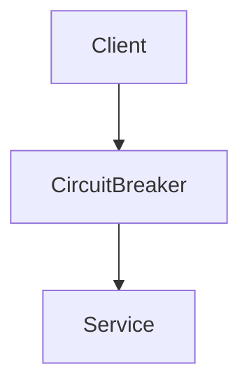

**Key Benefits:**

* Prevents cascading failures
* Improves system resilience

**Potential Drawbacks / Considerations:**

* Must tune thresholds and fallback logic carefully

{: #pattern-circuit-breaker }

### Sidecar

Solves service concerns separation by offloading non-business logic tasks to a sidecar process.

In this pattern, helper functionality (like logging, proxying, or monitoring) is delegated to a co-deployed process, called a sidecar. The sidecar runs alongside the main service in the same pod or container. Common in service meshes like Istio or Linkerd.

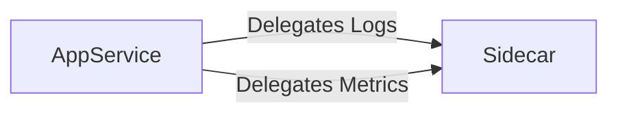

**Key Benefits:**

* Simplifies application code
* Enables consistent infrastructure features

**Potential Drawbacks / Considerations:**

* Slightly increases operational complexity

{: #pattern-sidecar }

### Saga

Solves distributed transaction management by breaking transactions into local steps with compensations.

Since ACID transactions are hard in microservices, Saga breaks them into a sequence of local transactions. Each step sends a message or event to trigger the next, and includes compensation logic for rollback. Can be orchestrated (central coordinator) or choreographed (event-based).

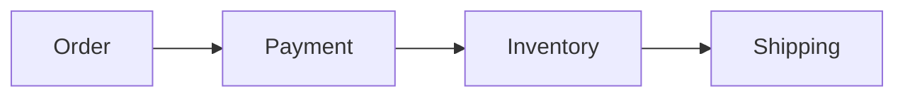

**Key Benefits:**

* Enables long-running transactions
* Ensures eventual consistency

**Potential Drawbacks / Considerations:**

* Requires complex compensation logic

{: #pattern-saga }

### Bulkhead

Solves resource isolation by partitioning service dependencies into separate pools.

Inspired by ship bulkheads, this pattern isolates failure domains. You allocate separate thread pools, connection pools, or containers for different service functions. That way, a failure in one area doesn’t sink the whole ship. Supported by frameworks like Resilience4j.

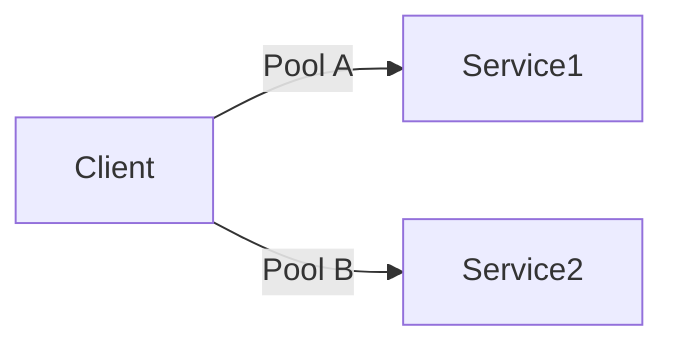

**Key Benefits:**

* Contains faults to specific areas
* Protects critical resources

**Potential Drawbacks / Considerations:**

* Overhead in managing isolated pools

{: #pattern-bulkhead }

# II. Distributed Systems Design Patterns

Distributed systems are inherently complex, with challenges around state, coordination, and availability. As the architect, you need to account for latency, partial failures, and concurrency. The following patterns help you manage consistency, scalability, and coordination in large-scale, distributed environments.

### Leader Election

Solves coordination by selecting one node to act as the leader.

When tasks require exclusive execution—like scheduling—you elect a leader node. Tools like Zookeeper or etcd use consensus algorithms (e.g., Raft) for this purpose.

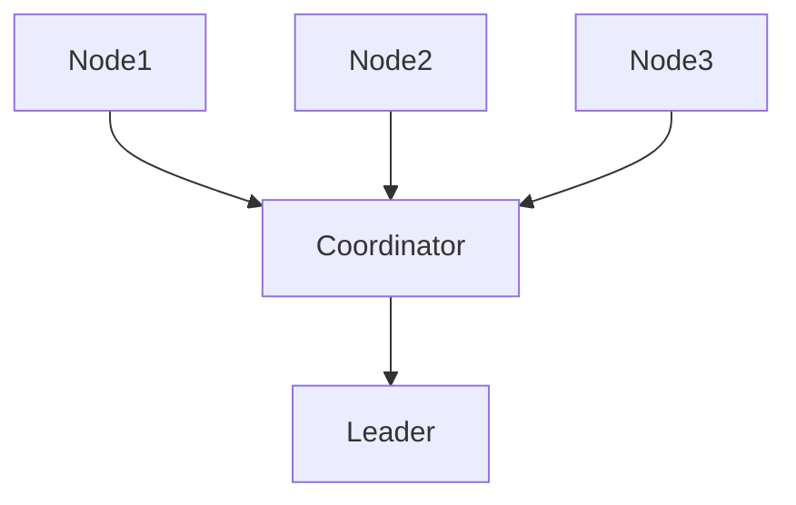

**Key Benefits:**

* Ensures consistent decision-making
* Prevents conflicts

**Potential Drawbacks / Considerations:**

* Requires robust consensus protocol

{: #pattern-leader-election }

### Distributed Lock

Solves concurrent access issues by synchronizing operations across nodes.

To prevent race conditions, you use a distributed lock that ensures only one node performs an action. Implemented using Redis, Zookeeper, or etcd.

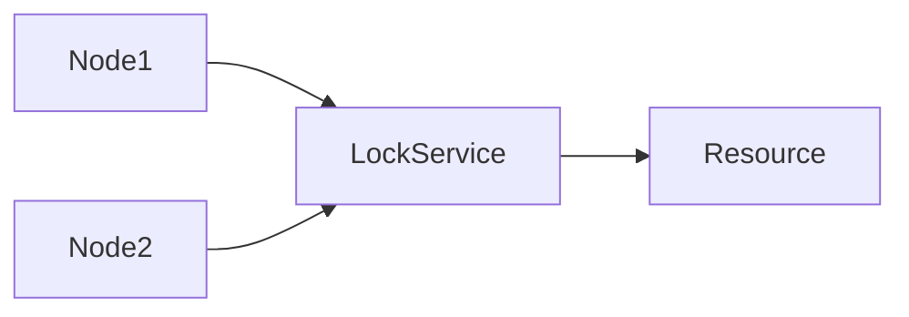

**Key Benefits:**

* Provides mutual exclusion
* Protects shared state

**Potential Drawbacks / Considerations:**

* Needs to handle lock expiry and recovery

{: #pattern-distributed-lock }

### Event Sourcing

Solves state management by storing changes as a sequence of events.

Instead of saving just the current state, you store all state changes as events. This allows reconstruction of state and auditability. Common in Axon Framework or Kafka-based systems.

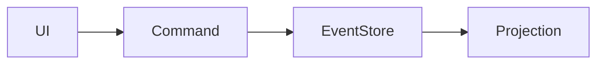

**Key Benefits:**

* Full history of changes
* Enables temporal queries

**Potential Drawbacks / Considerations:**

* Complex event replay and schema evolution

{: #pattern-event-sourcing }

### CQRS

Solves read-write optimization by separating command and query responsibilities.

You maintain different models for updates (commands) and reads (queries). Commands go through business logic; queries use denormalized views. Often paired with Event Sourcing.

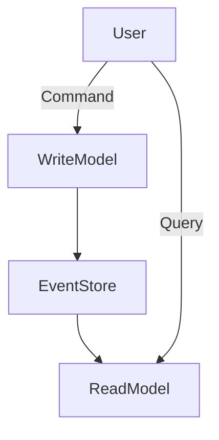

**Key Benefits:**

* Scales reads and writes independently
* Optimized query performance

**Potential Drawbacks / Considerations:**

* Eventual consistency between models

{: #pattern-cqrs }

### Sharding

Solves data scaling by partitioning datasets across nodes.

You split data across multiple databases (shards) based on a key (e.g., customer ID). Each shard handles a subset of the data. Common in MongoDB and PostgreSQL.

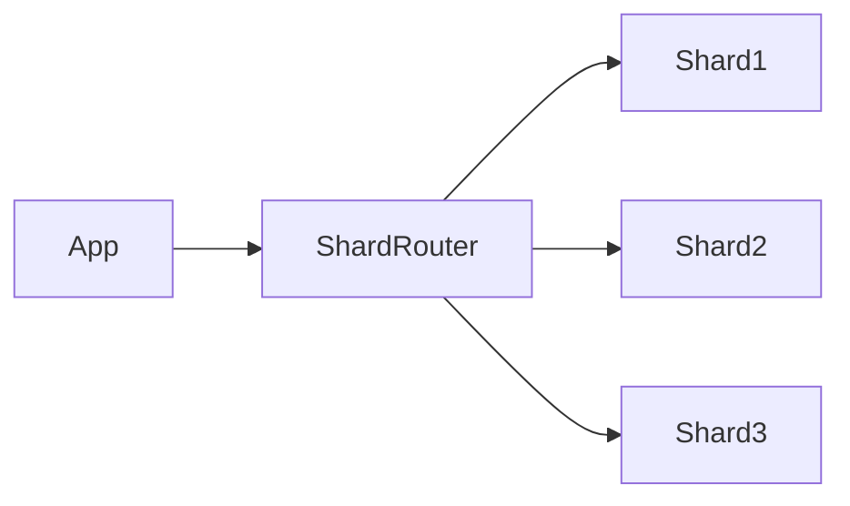

**Key Benefits:**

* Scales horizontally
* Isolates data workloads

**Potential Drawbacks / Considerations:**

* Requires careful partitioning strategy

{: #pattern-sharding }

### Consistent Hashing

Solves node addition/removal impact by minimizing data redistribution.

Instead of hashing directly to nodes, you hash to a ring and map data to nearest node. Widely used in caches like Memcached and distributed storage systems.

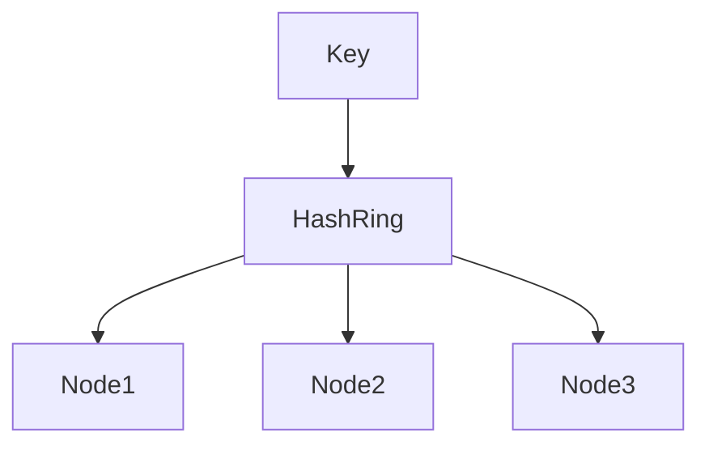

**Key Benefits:**

* Reduces rebalancing cost
* Handles dynamic scaling

**Potential Drawbacks / Considerations:**

* Needs good virtual node design

{: #pattern-consistent-hashing }

# Conclusion

By using these microservices and distributed systems patterns, you equip your architecture with proven tools to handle complexity, scale reliably, and stay resilient under load. From service discovery to leader election, these patterns are the building blocks of robust modern systems.
