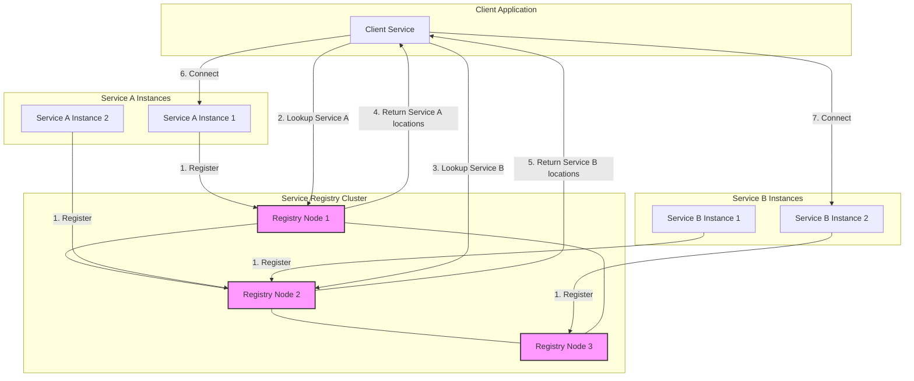
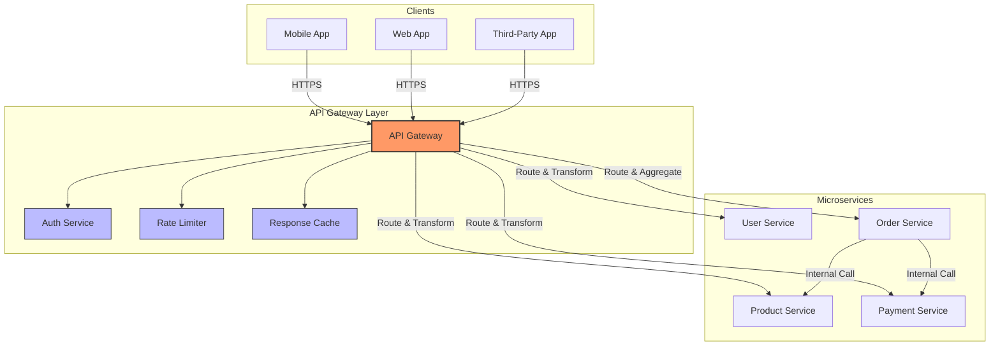
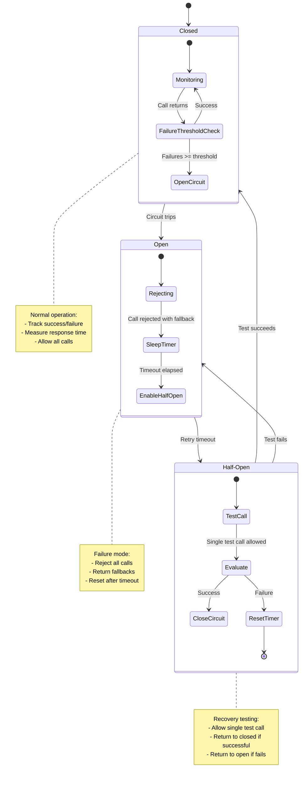
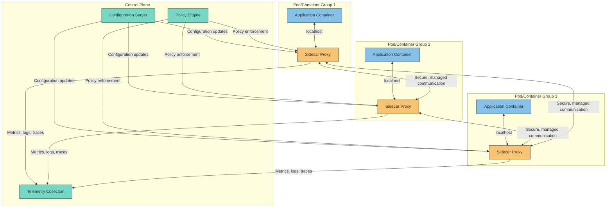
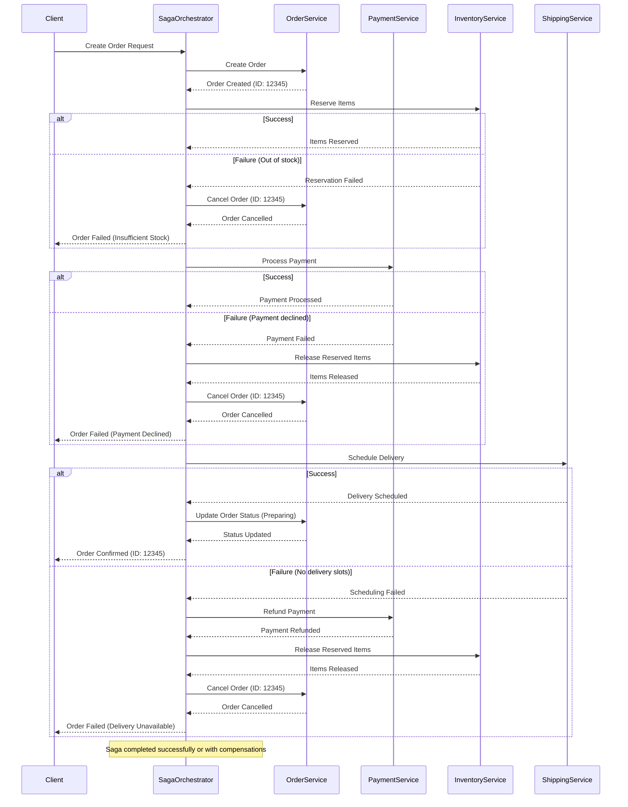
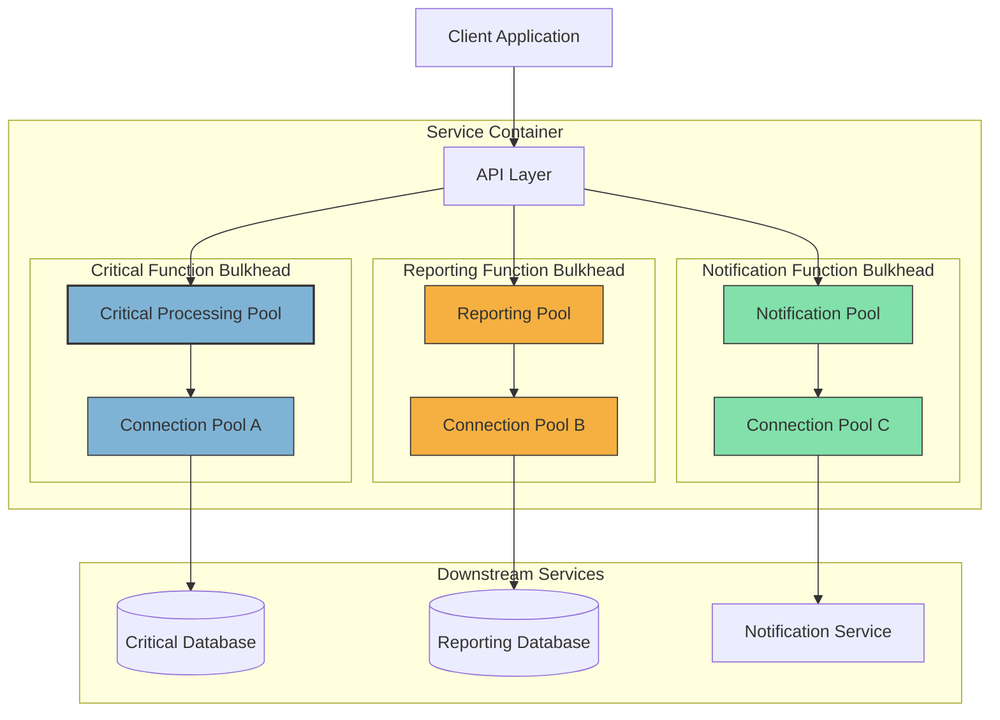
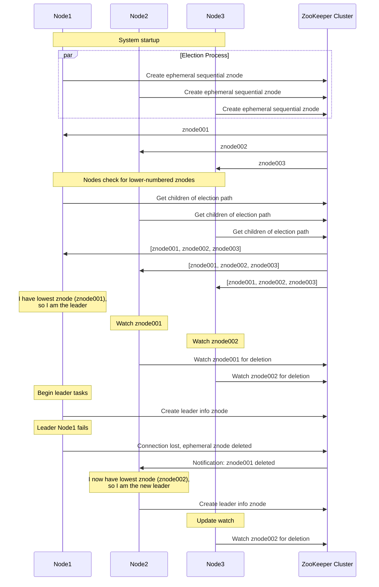
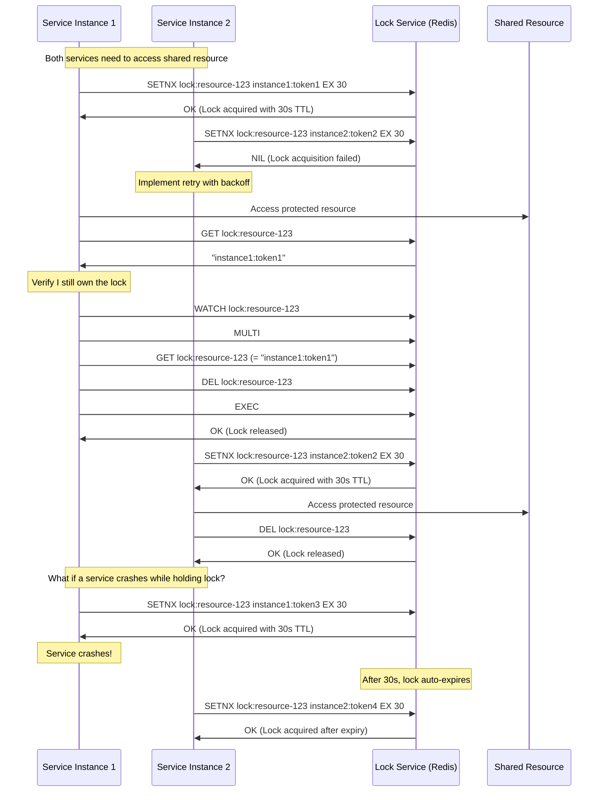

# I. Microservices Design Patterns

Designing microservices isn't just about breaking a system into smaller parts—it's about doing so in a way that ensures scalability, resilience, and maintainability. As you, the architect, piece together a modern system, understanding and applying proven design patterns makes the difference between fragile services and battle-hardened infrastructure. The following microservices patterns address key concerns such as service coordination, fault tolerance, and system observability. Each one helps to tame the complexity inherent in distributed systems.

## Service Registry & Discovery

**Problem Solved**: Dynamic service resolution in highly volatile environments where service instances come and go frequently.

**Detailed Solution**: Modern containerized environments like Kubernetes, Docker Swarm, or cloud platforms frequently create, destroy, and move service instances, causing their network locations to change. A Service Registry acts as a centralized directory where services register their availability and network coordinates (IP address, port, etc.) upon startup.

Client applications query this registry to locate and connect to desired services rather than hardcoding connection details. This enables:

1. **Automatic load balancing** across multiple instances
2. **Health checking** to route traffic only to healthy instances  
3. **Dynamic scaling** without client reconfiguration
4. **Location transparency** for services

### Implementation Options:

1. **Server-side discovery**: A load balancer queries the service registry and routes client requests (simpler for clients)
2. **Client-side discovery**: Clients query the registry directly and make their own routing decisions (more flexible)

### Popular Implementations:

- **Netflix Eureka**: Java-based service registry with REST API
- **HashiCorp Consul**: Feature-rich solution with health checking and DNS interface
- **etcd**: Distributed key-value store used by Kubernetes
- **Apache Zookeeper**: Reliable coordination service
- **Kubernetes Service Discovery**: Built into the platform



### Detailed Code Example (Spring Boot with Eureka):

**Service Registration:**

```java
// In service application
@SpringBootApplication
@EnableEurekaClient  // Mark as a Eureka client
public class PaymentServiceApplication {
    public static void main(String[] args) {
        SpringApplication.run(PaymentServiceApplication.class, args);
    }
}

// application.yml
spring:
  application:
    name: payment-service  # Service name in registry
eureka:
  client:
    serviceUrl:
      defaultZone: http://eureka-server1:8761/eureka/,http://eureka-server2:8762/eureka/
  instance:
    preferIpAddress: true
    instanceId: ${spring.application.name}:${spring.application.instance_id:${random.value}}
```

**Service Discovery and Consumption:**

```java
@Configuration
public class RestTemplateConfig {
    
    @Bean
    @LoadBalanced  // Enable client-side load balancing
    public RestTemplate loadBalancedRestTemplate() {
        return new RestTemplate();
    }
}

@Service
public class OrderService {
    
    private final RestTemplate restTemplate;
    
    public OrderService(RestTemplate restTemplate) {
        this.restTemplate = restTemplate;
    }
    
    public PaymentResponse processPayment(PaymentRequest request) {
        // Use service name (from registry) instead of hardcoded URL
        return restTemplate.postForObject(
            "http://payment-service/api/payments",
            request,
            PaymentResponse.class
        );
    }
}
```

**Key Benefits:**

* Supports dynamic scaling and resiliency in volatile environments
* Decouples service location logic from business logic
* Enables blue/green deployments and A/B testing
* Provides runtime adaptation to changing network topology
* Simplifies load balancing across service instances

**Potential Drawbacks / Considerations:**

* Registry availability becomes critical (requires HA deployment)
* Additional network hops can increase latency
* Requires appropriate caching strategy to prevent overloading registry
* Consistency challenges in distributed registry implementations
* Health check configuration is critical to prevent routing to unhealthy instances

## API Gateway

**Problem Solved**: Managing external client access to a complex microservices ecosystem.

**Detailed Solution**: In a microservices architecture, direct client-to-service communication creates numerous challenges including:

1. Different clients (mobile, web, IoT) have different needs
2. Multiple round-trips for composite operations
3. Complex authentication/authorization across services
4. Inconsistent API design and protocols
5. Exposure of internal service structure to external clients

An API Gateway serves as a central entry point that:

1. **Routes** requests to appropriate services
2. **Aggregates** responses from multiple services
3. **Transforms** data for specific clients (mobile vs. desktop)
4. Implements **cross-cutting concerns** like:
   - Authentication & authorization
   - Rate limiting & throttling
   - Request/response transformation
   - Caching
   - Circuit breaking
   - Analytics & monitoring
   - SSL termination

### Implementation Patterns:

1. **Single gateway**: One gateway for all clients (simpler but less flexible)
2. **Backend for Frontend (BFF)**: Specialized gateways for each client type (mobile, web, etc.)

### Popular Implementations:

- **Spring Cloud Gateway**: Reactive API gateway built on Spring WebFlux
- **Kong**: Lua-based, high-performance gateway built on NGINX
- **Amazon API Gateway**: AWS-native managed solution
- **Azure API Management**: Microsoft's API gateway solution
- **Apigee**: Google Cloud's full API management platform



### Detailed Code Example (Spring Cloud Gateway):

**Gateway Configuration:**

```java
@SpringBootApplication
@EnableDiscoveryClient  // Enable service discovery
public class ApiGatewayApplication {
    public static void main(String[] args) {
        SpringApplication.run(ApiGatewayApplication.class, args);
    }
}

// application.yml
spring:
  cloud:
    gateway:
      routes:
        - id: user-service
          uri: lb://user-service  # Load balanced URI (uses service discovery)
          predicates:
            - Path=/api/users/**
          filters:
            - StripPrefix=1
            - name: CircuitBreaker
              args:
                name: userServiceCircuitBreaker
                fallbackUri: forward:/fallback/users
            - name: RequestRateLimiter
              args:
                redis-rate-limiter.replenishRate: 10
                redis-rate-limiter.burstCapacity: 20
        
        - id: product-service
          uri: lb://product-service
          predicates:
            - Path=/api/products/**
          filters:
            - StripPrefix=1
            - AddResponseHeader=X-Response-Time, ${requestTime}

        - id: composite-order
          uri: lb://order-aggregator-service
          predicates:
            - Path=/api/orders/**
            - Method=GET
```

**Custom Gateway Filter for Authentication:**

```java
@Component
public class JwtAuthenticationFilter extends AbstractGatewayFilterFactory<JwtAuthenticationFilter.Config> {
    
    private final JwtTokenValidator tokenValidator;
    
    public JwtAuthenticationFilter(JwtTokenValidator tokenValidator) {
        super(Config.class);
        this.tokenValidator = tokenValidator;
    }
    
    @Override
    public GatewayFilter apply(Config config) {
        return (exchange, chain) -> {
            ServerHttpRequest request = exchange.getRequest();
            
            // Check for JWT token in Authorization header
            List<String> authHeaders = request.getHeaders().get("Authorization");
            if (authHeaders == null || authHeaders.isEmpty() || !authHeaders.get(0).startsWith("Bearer ")) {
                return handleUnauthorized(exchange);
            }
            
            String token = authHeaders.get(0).substring(7);
            try {
                // Validate token and extract claims
                Claims claims = tokenValidator.validateToken(token);
                
                // Add claims to request headers for downstream services
                ServerHttpRequest modifiedRequest = exchange.getRequest().mutate()
                    .header("X-User-Id", claims.getSubject())
                    .header("X-User-Roles", String.join(",", 
                        claims.get("roles", List.class)))
                    .build();
                
                return chain.filter(exchange.mutate().request(modifiedRequest).build());
            } catch (Exception e) {
                return handleUnauthorized(exchange);
            }
        };
    }
    
    private Mono<Void> handleUnauthorized(ServerWebExchange exchange) {
        ServerHttpResponse response = exchange.getResponse();
        response.setStatusCode(HttpStatus.UNAUTHORIZED);
        return response.setComplete();
    }
    
    public static class Config {
        // Configuration properties if needed
    }
}
```

**Key Benefits:**

* Centralizes authentication, monitoring, and cross-cutting concerns
* Simplifies client interaction with complex microservice ecosystems
* Enables API composition for optimal client experience
* Insulates clients from internal service changes
* Provides consistent interface for different client platforms
* Allows for specialized handling of different client types (mobile vs. web)

**Potential Drawbacks / Considerations:**

* Gateway can become a performance bottleneck if not properly designed
* Single point of failure requires HA deployment
* Can add latency to requests
* Request transformation logic can become complex
* Gateway development team becomes a potential bottleneck for API changes
* Requires careful caching strategy to optimize performance

## Circuit Breaker

**Problem Solved**: Preventing cascading failures when dependent services fail.

**Detailed Solution**: In distributed systems, service calls frequently cross network boundaries, introducing many potential failure points. When a downstream service fails, the impact can cascade through the entire system causing widespread outages.

The Circuit Breaker pattern:

1. **Monitors** service calls for failures
2. **Trips** (opens) after a threshold of failures is reached
3. **Rejects** calls while open, preventing resource exhaustion
4. **Tests** the failing service periodically (half-open state)
5. **Resets** (closes) when the service recovers

### States of a Circuit Breaker:

1. **Closed**: Normal operation, calls pass through
2. **Open**: Failing service is isolated, calls fail fast
3. **Half-Open**: Testing if service has recovered

### Advanced Capabilities:

- **Fallback mechanisms**: Alternative responses when circuit is open
- **Timeout handling**: Detecting slow services
- **Bulkheading**: Isolating resources for different services
- **Request bucketing**: Tracking success/failure rates in time windows
- **Health metrics**: Exposing circuit state for monitoring

### Popular Implementations:

- **Resilience4j**: Lightweight Java library inspired by Hystrix
- **Netflix Hystrix**: Java library for latency and fault tolerance (now in maintenance mode)
- **Polly**: .NET resilience and transient fault-handling library
- **Istio**: Service mesh with built-in circuit breaking
- **Spring Cloud Circuit Breaker**: Abstraction layer over different implementations



### Detailed Code Example (Resilience4j with Spring Boot):

**Circuit Breaker Configuration:**

```java
@Configuration
public class ResilienceConfig {
    
    @Bean
    public CircuitBreakerRegistry circuitBreakerRegistry() {
        // Define custom circuit breaker configurations
        CircuitBreakerConfig defaultConfig = CircuitBreakerConfig.custom()
            .failureRateThreshold(50)          // 50% failure rate triggers open state
            .waitDurationInOpenState(Duration.ofSeconds(30))  // Time in open state
            .permittedNumberOfCallsInHalfOpenState(10)        // Test calls in half-open
            .slidingWindowType(SlidingWindowType.COUNT_BASED) // Count-based monitoring
            .slidingWindowSize(100)            // Window for failure rate calculation
            .recordExceptions(IOException.class, HttpClientErrorException.class)
            .build();
            
        // Create specialized configurations for different services
        Map<String, CircuitBreakerConfig> configs = new HashMap<>();
        
        // Payment service gets a more sensitive configuration
        configs.put("paymentService", CircuitBreakerConfig.custom()
            .failureRateThreshold(30)          // More sensitive threshold
            .waitDurationInOpenState(Duration.ofSeconds(60))
            .permittedNumberOfCallsInHalfOpenState(5)
            .build());
            
        return CircuitBreakerRegistry.of(defaultConfig, configs);
    }
    
    @Bean
    public TimeLimiterRegistry timeLimiterRegistry() {
        TimeLimiterConfig config = TimeLimiterConfig.custom()
            .timeoutDuration(Duration.ofSeconds(5))  // Global timeout default
            .build();
            
        return TimeLimiterRegistry.of(config);
    }
}
```

**Service Implementation with Circuit Breaker:**

```java
@Service
public class OrderService {
    
    private final RestTemplate restTemplate;
    private final CircuitBreakerRegistry circuitBreakerRegistry;
    private final TimeLimiterRegistry timeLimiterRegistry;
    
    public OrderService(RestTemplate restTemplate, 
                         CircuitBreakerRegistry circuitBreakerRegistry,
                         TimeLimiterRegistry timeLimiterRegistry) {
        this.restTemplate = restTemplate;
        this.circuitBreakerRegistry = circuitBreakerRegistry;
        this.timeLimiterRegistry = timeLimiterRegistry;
    }
    
    public OrderResponse createOrder(OrderRequest request) {
        // Get or create circuit breaker for payment service
        CircuitBreaker paymentCircuitBreaker = 
            circuitBreakerRegistry.circuitBreaker("paymentService");
            
        // Get or create time limiter for payment service
        TimeLimiter paymentTimeLimiter =
            timeLimiterRegistry.timeLimiter("paymentService");
            
        // Define function to execute
        Supplier<PaymentResponse> paymentServiceCall = () -> 
            restTemplate.postForObject(
                "http://payment-service/api/payments",
                request.getPaymentDetails(),
                PaymentResponse.class
            );
            
        // Define fallback function
        Function<Exception, PaymentResponse> fallback = ex -> {
            if (ex instanceof CallNotPermittedException) {
                // Circuit is open
                log.warn("Payment service circuit is OPEN, using fallback response");
            } else {
                // Other error occurred
                log.error("Payment service call failed", ex);
            }
            
            // Return fallback response
            return PaymentResponse.fallback(request.getPaymentDetails().getAmount());
        };
        
        // Execute with circuit breaker and time limiter
        try {
            PaymentResponse paymentResponse = Decorators.ofSupplier(paymentServiceCall)
                .withCircuitBreaker(paymentCircuitBreaker)
                .withFallback(fallback)
                .withTimeLimiter(paymentTimeLimiter)
                .get();
                
            // Process successful payment and complete order
            return completeOrder(request, paymentResponse);
        } catch (Exception e) {
            // Handle exceptions not covered by fallback
            log.error("Unexpected error creating order", e);
            throw new OrderCreationException("Failed to create order", e);
        }
    }
    
    // Implementation of completeOrder method...
}
```

**Key Benefits:**

* Prevents cascading failures throughout the system
* Improves overall system resilience by isolating failing components
* Enables self-healing through automatic recovery attempts
* Provides fail-fast behavior instead of hanging indefinitely
* Reduces resource waste on doomed requests
* Offers graceful degradation through fallback mechanisms

**Potential Drawbacks / Considerations:**

* Requires careful tuning of thresholds and timeouts
* Fallback logic can be complex to implement correctly
* Testing multiple circuit breaker scenarios is challenging
* May hide underlying issues if fallbacks are too effective
* Metrics collection is essential for proper configuration
* Multiple layers of circuit breakers can interact in complex ways

## Sidecar

**Problem Solved**: Separation of cross-cutting operational concerns from business logic in microservices.

**Detailed Solution**: Microservices should focus on business functionality, but they also need operational capabilities like monitoring, logging, security, and service discovery. The Sidecar pattern:

1. **Deploys** a separate helper container/process alongside the main service
2. **Offloads** infrastructure concerns to this sidecar
3. **Provides** consistent operational capabilities across services in different languages
4. **Enables** upgrading operational features without modifying application code

This pattern is a cornerstone of service mesh architectures, where sidecars (often called "proxies") form a communication fabric between services.

### Common Sidecar Responsibilities:

1. **Logging & Monitoring**: Collecting, processing, and forwarding telemetry data
2. **Traffic Management**: Load balancing, circuit breaking, retry logic
3. **Security**: TLS termination, authentication, authorization
4. **Configuration**: Dynamic configuration management
5. **Service Discovery**: Finding and connecting to other services

### Popular Implementations:

- **Istio/Envoy**: Full service mesh with Envoy proxy as sidecar
- **Linkerd**: Lightweight Kubernetes service mesh
- **Ambassador/Emissary**: Kubernetes-native API Gateway based on Envoy
- **AWS App Mesh**: AWS managed service mesh
- **Dapr**: Portable, event-driven runtime for microservices



### Detailed Code Example (Istio with Kubernetes):

**Kubernetes Deployment with Istio Sidecar Injection:**

```yaml
# service.yaml
apiVersion: v1
kind: Service
metadata:
  name: order-service
  labels:
    app: order-service
spec:
  selector:
    app: order-service
  ports:
  - port: 80
    name: http
    targetPort: 8080
---
# deployment.yaml
apiVersion: apps/v1
kind: Deployment
metadata:
  name: order-service
  labels:
    app: order-service
spec:
  replicas: 3
  selector:
    matchLabels:
      app: order-service
  template:
    metadata:
      labels:
        app: order-service
      annotations:
        sidecar.istio.io/inject: "true"  # Enable Istio sidecar injection
    spec:
      containers:
      - name: order-service
        image: example/order-service:v1
        ports:
        - containerPort: 8080
        resources:
          requests:
            memory: "128Mi"
            cpu: "100m"
          limits:
            memory: "256Mi"
            cpu: "200m"
```

**Istio Virtual Service Configuration:**

```yaml
# virtual-service.yaml
apiVersion: networking.istio.io/v1beta1
kind: VirtualService
metadata:
  name: order-service
spec:
  hosts:
  - order-service
  http:
  - route:
    - destination:
        host: order-service
        subset: v1
    retries:
      attempts: 3
      perTryTimeout: 2s
    timeout: 5s
---
# destination-rule.yaml
apiVersion: networking.istio.io/v1beta1
kind: DestinationRule
metadata:
  name: order-service
spec:
  host: order-service
  trafficPolicy:
    connectionPool:
      tcp:
        maxConnections: 100
      http:
        http1MaxPendingRequests: 10
    outlierDetection:
      consecutiveErrors: 5
      interval: 30s
      baseEjectionTime: 60s
  subsets:
  - name: v1
    labels:
      version: v1
```

**Implementing Distributed Tracing with Sidecar:**

```java
@RestController
@RequestMapping("/api/orders")
public class OrderController {
    
    private final OrderService orderService;
    
    public OrderController(OrderService orderService) {
        this.orderService = orderService;
    }
    
    @PostMapping
    public ResponseEntity<OrderResponse> createOrder(
            @RequestBody OrderRequest request,
            @RequestHeader HttpHeaders headers) {
        
        // The sidecar automatically propagates trace headers
        // No need to explicitly handle trace propagation in application code
        OrderResponse response = orderService.createOrder(request);
        return ResponseEntity.ok(response);
    }
}

// In application.yml
spring:
  application:
    name: order-service
management:
  tracing:
    sampling:
      probability: 1.0  # Sample all requests in development
  zipkin:
    tracing:
      endpoint: http://zipkin:9411/api/v2/spans  # Sidecar forwards to Zipkin
```

**Key Benefits:**

* Simplifies application code by separating infrastructure concerns
* Enables consistent infrastructure features across polyglot services
* Allows independent upgrading of operational capabilities
* Provides centralized policy enforcement
* Adds advanced networking features without changing application code
* Enhances observability through standardized telemetry collection

**Potential Drawbacks / Considerations:**

* Increases resource consumption (memory, CPU) per service
* Adds network hop latency for each service call
* Increases deployment complexity
* Debugging becomes more complex with additional components
* Requires coordination between application and platform teams
* May introduce version compatibility challenges between application and sidecar

## Saga

**Problem Solved**: Managing distributed transactions and data consistency across microservices.

**Detailed Solution**: Traditional ACID transactions don't work well in distributed microservices because:
1. Services often have their own databases
2. Two-phase commit protocols are difficult to implement and reduce availability
3. Long-lived locks create contention and scaling problems

The Saga pattern breaks down distributed transactions into a sequence of local transactions, each with associated compensating transactions to undo changes if a failure occurs. This ensures eventual consistency while maintaining service independence.

### Saga Coordination Styles:

1. **Choreography**: Services communicate through events without a central coordinator
   - Services publish events when they complete transactions
   - Other services listen and react to these events
   - More decentralized but harder to monitor

2. **Orchestration**: A central coordinator controls the transaction flow
   - Coordinator calls services in the correct sequence
   - Tracks progress and manages failure handling
   - More centralized but easier to monitor and maintain

### Implementation Considerations:

- **Idempotency**: Services must handle duplicate requests safely
- **Compensation Logic**: Must undo operations in reverse order
- **State Tracking**: Must persist saga state for recovery
- **Timeouts & Retries**: Essential for handling transient failures
- **Visibility**: Transaction monitoring is critical

### Popular Implementations:

- **Axon Framework**: Java framework supporting sagas
- **Eventuate Tram Sagas**: Java library for choreographed sagas
- **MassTransit**: .NET saga implementation
- **Camunda**: Business process engine supporting sagas
- **Apache Camel**: Integration framework with saga support



### Detailed Code Example (Orchestration Saga with Spring Boot):

**Saga Orchestrator:**

```java
@Service
public class OrderSagaOrchestrator {
    
    private final OrderService orderService;
    private final PaymentService paymentService;
    private final InventoryService inventoryService;
    private final ShippingService shippingService;
    private final SagaLogRepository sagaLogRepository;
    
    public OrderSagaOrchestrator(
            OrderService orderService,
            PaymentService paymentService,
            InventoryService inventoryService,
            ShippingService shippingService,
            SagaLogRepository sagaLogRepository) {
        this.orderService = orderService;
        this.paymentService = paymentService;
        this.inventoryService = inventoryService;
        this.shippingService = shippingService;
        this.sagaLogRepository = sagaLogRepository;
    }
    
    @Transactional
    public OrderResponse createOrder(OrderRequest request) {
        // Create saga log entry with unique ID
        String sagaId = UUID.randomUUID().toString();
        SagaLog sagaLog = new SagaLog(sagaId, "CREATE_ORDER", SagaStatus.STARTED);
        sagaLogRepository.save(sagaLog);
        
        try {
            // Step 1: Create Order
            OrderDTO order = orderService.createOrder(request, sagaId);
            updateSagaLog(sagaId, "ORDER_CREATED", SagaStatus.IN_PROGRESS);
            
            // Step 2: Reserve Inventory
            try {
                inventoryService.reserveItems(order.getItems(), sagaId);
                updateSagaLog(sagaId, "INVENTORY_RESERVED", SagaStatus.IN_PROGRESS);
            } catch (Exception e) {
                // Compensation: Cancel Order
                orderService.cancelOrder(order.getId(), sagaId);
                updateSagaLog(sagaId, "SAGA_FAILED_INVENTORY", SagaStatus.FAILED);
                throw new OrderCreationException("Failed to reserve inventory: " + e.getMessage());
            }
            
            // Step 3: Process Payment
            try {
                PaymentDTO payment = paymentService.processPayment(
                    order.getId(), 
                    request.getPaymentDetails(),
                    sagaId
                );
                updateSagaLog(sagaId, "PAYMENT_PROCESSED", SagaStatus.IN_PROGRESS);
            } catch (Exception e) {
                // Compensations in reverse order
                inventoryService.releaseItems(order.getItems(), sagaId);
                orderService.cancelOrder(order.getId(), sagaId);
                updateSagaLog(sagaId, "SAGA_FAILED_PAYMENT", SagaStatus.FAILED);
                throw new OrderCreationException("Payment failed: " + e.getMessage());
            }
            
            // Step 4: Schedule Shipping
            try {
                ShippingDTO shipping = shippingService.scheduleDelivery(
                    order.getId(),
                    request.getShippingAddress(),
                    sagaId
                );
                updateSagaLog(sagaId, "SHIPPING_SCHEDULED", SagaStatus.IN_PROGRESS);
                
                // Complete the order
                OrderDTO completedOrder = orderService.updateOrderStatus(
                    order.getId(), 
                    OrderStatus.CONFIRMED,
                    sagaId
                );
                updateSagaLog(sagaId, "SAGA_COMPLETED", SagaStatus.COMPLETED);
                
                return new OrderResponse(completedOrder, shipping, OrderResultStatus.SUCCESS);
            } catch (Exception e) {
                // Compensations in reverse order
                paymentService.refundPayment(order.getId(), sagaId);
                inventoryService.releaseItems(order.getItems(), sagaId);
                orderService.cancelOrder(order.getId(), sagaId);
                updateSagaLog(sagaId, "SAGA_FAILED_SHIPPING", SagaStatus.FAILED);
                throw new OrderCreationException("Delivery scheduling failed: " + e.getMessage());
            }
            
        } catch (OrderCreationException e) {
            // These exceptions already have compensations applied
            return new OrderResponse(null, null, OrderResultStatus.FAILED, e.getMessage());
        } catch (Exception e) {
            // Unexpected exception - log and report failure
            updateSagaLog(sagaId, "SAGA_FAILED_UNEXPECTED: " + e.getMessage(), SagaStatus.FAILED);
            return new OrderResponse(null, null, OrderResultStatus.FAILED, "Unexpected error occurred");
        }
    }
    
    private void updateSagaLog(String sagaId, String step, SagaStatus status) {
        SagaLog log = sagaLogRepository.findBySagaId(sagaId);
        log.setCurrentStep(step);
        log.setStatus(status);
        log.addStepHistory(step);
        sagaLogRepository.save(log);
    }
}
```

**Choreography Example (Event-Driven):**

```java
// In Order Service
@Service
public class OrderService {
    
    private final OrderRepository orderRepository;
    private final EventPublisher eventPublisher;
    
    @Transactional
    public OrderDTO createOrder(OrderRequest request) {
        // Create and save the order
        Order order = new Order(request);
        order.setStatus(OrderStatus.PENDING);
        orderRepository.save(order);
        
        // Publish order created event to trigger next steps
        eventPublisher.publish(new OrderCreatedEvent(
            order.getId(),
            order.getCustomerId(),
            order.getItems(),
            order.getTotalAmount()
        ));
        
        return mapToDTO(order);
    }
    
    // Listen for inventory reservation failure
    @EventListener
    @Transactional
    public void handleInventoryReservationFailed(InventoryReservationFailedEvent event) {
        if (event.getOrderId().equals(this.orderId)) {
            Order order = orderRepository.findById(event.getOrderId());
            order.setStatus(OrderStatus.CANCELLED);
            order.addNote("Cancelled due to inventory shortage");
            orderRepository.save(order);
            
            // Publish order cancelled event
            eventPublisher.publish(new OrderCancelledEvent(
                order.getId(),
                "Insufficient inventory"
            ));
        }
    }
    
    // Other event handlers for payment failures, shipping issues, etc.
}
```

**Key Benefits:**

* Enables distributed transactions without locking resources
* Preserves service independence and autonomy
* Provides eventual consistency across services
* Maintains business invariants across distributed systems
* Scales better than traditional distributed transactions
* Creates an explicit history of transaction steps

**Potential Drawbacks / Considerations:**

* Requires complex compensation logic
* Increases development and testing complexity
* Saga state must be persisted for reliability
* Error recovery paths multiply with each step
* Long-running sagas can be difficult to manage
* Transaction isolation is weakened (others can see intermediate states)
* Requires careful design of idempotent operations

## Bulkhead

**Problem Solved**: Preventing a single failing component from consuming all system resources.

**Detailed Solution**: In naval architecture, ships are divided into watertight compartments called bulkheads to prevent a single breach from sinking the entire vessel. Similarly, the Bulkhead pattern isolates components of an application into pools so failures in one area can't take down the entire system.

This pattern:

1. **Partitions** service resources (threads, connections, memory)
2. **Isolates** failures to specific components
3. **Prevents** resource exhaustion from spreading
4. **Maintains** critical functionality even when non-critical parts fail

### Implementation Approaches:

1. **Thread Pool Isolation**: Separate thread pools for different service dependencies
2. **Connection Pool Isolation**: Separate connection pools for different databases
3. **Process Isolation**: Different services in separate processes/containers
4. **Deployment Isolation**: Critical and non-critical functionality on separate infrastructure

### Popular Implementations:

- **Resilience4j Bulkhead**: Thread pool and semaphore-based isolation
- **Hystrix**: Thread pool isolation (now in maintenance mode)
- **Service Meshes (Istio, Linkerd)**: Connection-level bulkheads
- **Kubernetes Resource Quotas**: Container-level isolation
- **Azure Bulkhead Policy**: .NET implementation



### Detailed Code Example (Resilience4j Bulkhead with Spring Boot):

**Bulkhead Configuration:**

```java
@Configuration
public class ResilienceConfig {
    
    @Bean
    public BulkheadRegistry bulkheadRegistry() {
        // Create default configuration
        BulkheadConfig defaultConfig = BulkheadConfig.custom()
            .maxConcurrentCalls(10)         // Max concurrent executions
            .maxWaitDuration(Duration.ofMillis(500))  // Max wait for execution
            .build();
            
        // Create specialized configurations
        Map<String, BulkheadConfig> configs = new HashMap<>();
        
        // Critical services get more resources
        configs.put("paymentService", BulkheadConfig.custom()
            .maxConcurrentCalls(20)
            .maxWaitDuration(Duration.ofMillis(1000))
            .build());
            
        // Non-critical services get fewer resources
        configs.put("recommendationService", BulkheadConfig.custom()
            .maxConcurrentCalls(5)
            .maxWaitDuration(Duration.ofMillis(250))
            .build());
            
        return BulkheadRegistry.of(defaultConfig, configs);
    }
    
    @Bean
    public ThreadPoolBulkheadRegistry threadPoolBulkheadRegistry() {
        // Thread pool bulkhead provides queue for waiting tasks
        ThreadPoolBulkheadConfig defaultConfig = ThreadPoolBulkheadConfig.custom()
            .coreThreadPoolSize(5)
            .maxThreadPoolSize(10)
            .queueCapacity(50)
            .keepAliveDuration(Duration.ofMinutes(1))
            .build();
            
        // Configure specialized thread pools
        Map<String, ThreadPoolBulkheadConfig> configs = new HashMap<>();
        
        // Critical services get more threads
        configs.put("orderProcessing", ThreadPoolBulkheadConfig.custom()
            .coreThreadPoolSize(10)
            .maxThreadPoolSize(20)
            .queueCapacity(100)
            .build());
            
        return ThreadPoolBulkheadRegistry.of(defaultConfig, configs);
    }
}
```

**Service with Bulkhead Implementation:**

```java
@Service
public class OrderService {
    
    private final RestTemplate restTemplate;
    private final BulkheadRegistry bulkheadRegistry;
    private final ThreadPoolBulkheadRegistry threadPoolBulkheadRegistry;
    
    public OrderService(
            RestTemplate restTemplate,
            BulkheadRegistry bulkheadRegistry,
            ThreadPoolBulkheadRegistry threadPoolBulkheadRegistry) {
        this.restTemplate = restTemplate;
        this.bulkheadRegistry = bulkheadRegistry;
        this.threadPoolBulkheadRegistry = threadPoolBulkheadRegistry;
    }
    
    public OrderDetails getOrderDetails(String orderId) {
        // Get basic order info using semaphore bulkhead
        Bulkhead orderBulkhead = bulkheadRegistry.bulkhead("orderService");
        
        OrderInfo orderInfo = Bulkhead.decorateSupplier(
            orderBulkhead,
            () -> fetchOrderInfo(orderId)
        ).get();
        
        // Get payment details using thread pool bulkhead
        ThreadPoolBulkhead paymentBulkhead = 
            threadPoolBulkheadRegistry.bulkhead("paymentService");
            
        CompletableFuture<PaymentInfo> paymentFuture = 
            paymentBulkhead.executeSupplier(() -> fetchPaymentInfo(orderId));
        
        // Get shipping info using another bulkhead
        Bulkhead shippingBulkhead = bulkheadRegistry.bulkhead("shippingService");
        
        ShippingInfo shippingInfo = Bulkhead.decorateSupplier(
            shippingBulkhead,
            () -> fetchShippingInfo(orderId)
        ).get();
        
        // Get recommendations - non-critical with fallback
        Bulkhead recommendationBulkhead = 
            bulkheadRegistry.bulkhead("recommendationService");
            
        List<ProductRecommendation> recommendations = 
            Try.ofSupplier(
                Bulkhead.decorateSupplier(
                    recommendationBulkhead,
                    () -> fetchRecommendations(orderId)
                )
            ).recover(throwable -> Collections.emptyList()).get();
        
        // Wait for payment info (or timeout)
        PaymentInfo paymentInfo;
        try {
            paymentInfo = paymentFuture.get(1, TimeUnit.SECONDS);
        } catch (Exception e) {
            paymentInfo = PaymentInfo.unavailable();
        }
        
        // Combine all results
        return new OrderDetails(orderInfo, paymentInfo, shippingInfo, recommendations);
    }
    
    private OrderInfo fetchOrderInfo(String orderId) {
        return restTemplate.getForObject(
            "http://order-service/api/orders/{id}",
            OrderInfo.class,
            orderId
        );
    }
    
    // Other fetch methods implementation...
}
```

**Key Benefits:**

* Contains failures to isolated components
* Protects critical resources and functions
* Prevents resource exhaustion
* Improves overall system stability
* Enables graceful degradation during partial failures
* Allows different resource allocation strategies for different components

**Potential Drawbacks / Considerations:**

* Overhead in managing multiple resource pools
* Potential resource underutilization
* Requires careful sizing of each bulkhead
* May need dynamic bulkhead sizing for fluctuating loads
* Increased configuration complexity
* Requires clear understanding of component dependencies

# II. Distributed Systems Design Patterns

Distributed systems are inherently complex, with challenges around state, coordination, and availability. As the architect, you need to account for latency, partial failures, and concurrency. The following patterns help you manage consistency, scalability, and coordination in large-scale, distributed environments.

## Leader Election

**Problem Solved**: Coordinating exclusive task execution in distributed environments.

**Detailed Solution**: In distributed systems, certain tasks should only be executed by a single node to prevent conflicts, duplications, or data corruption. Examples include:

1. Scheduled batch jobs that should run exactly once
2. Data migration or synchronization processes
3. Global resource allocation
4. Cluster-wide configuration changes

Leader Election establishes a protocol to select one node as the "leader" that performs specific tasks while others remain "followers" until the leader fails.

### Election Approaches:

1. **Bully Algorithm**: Nodes with highest IDs become leaders
2. **Ring Algorithm**: Election messages circulate in a logical ring
3. **Consensus-based**: Using Paxos or Raft to achieve agreement
4. **Coordination Service**: Using ZooKeeper, etcd, or Consul

### Leader Responsibilities:

- Execute singleton tasks
- Coordinate work distribution
- Handle cluster-wide decisions
- Maintain global state

### Popular Implementations:

- **Apache ZooKeeper**: Robust coordination service
- **etcd**: Distributed key-value store with leader election
- **Consul**: Service mesh with leader election capabilities
- **Redis**: Using atomic operations for simple leader election
- **Spring Integration**: Leader election in Spring applications



### Detailed Code Example (ZooKeeper Leader Election):

**Leader Election with Curator Framework:**

```java
@Component
public class ZooKeeperLeaderElection {
    
    private static final Logger LOG = LoggerFactory.getLogger(ZooKeeperLeaderElection.class);
    private static final String ELECTION_PATH = "/election/leader";
    private static final String LEADER_INFO_PATH = "/election/info";
    
    private final CuratorFramework client;
    private final LeaderSelectorListener listener;
    private final LeaderSelector leaderSelector;
    private final ScheduledTaskService scheduledTaskService;
    private final String nodeId;
    
    public ZooKeeperLeaderElection(
            CuratorFramework client,
            ScheduledTaskService scheduledTaskService) {
        this.client = client;
        this.scheduledTaskService = scheduledTaskService;
        this.nodeId = generateNodeId();
        
        // Create leader selection listener
        this.listener = new LeaderSelectorListenerAdapter() {
            @Override
            public void takeLeadership(CuratorFramework client) throws Exception {
                LOG.info("Node {} has been elected leader", nodeId);
                try {
                    // Publish leader info for followers to see
                    publishLeaderInfo();
                    
                    // Perform leader-specific tasks
                    startLeaderTasks();
                    
                    // Keep leadership until interrupted
                    Thread.sleep(Long.MAX_VALUE);
                } catch (InterruptedException e) {
                    LOG.info("Leadership interrupted - releasing leadership");
                    Thread.currentThread().interrupt();
                } finally {
                    LOG.info("Node {} relinquishing leadership", nodeId);
                    stopLeaderTasks();
                }
            }
        };
        
        // Create leader selector
        this.leaderSelector = new LeaderSelector(client, ELECTION_PATH, listener);
        
        // Important: autoRequeue makes this selector try to reacquire leadership
        // after releasing it
        this.leaderSelector.autoRequeue();
    }
    
    public void start() {
        LOG.info("Starting leader election process for node {}", nodeId);
        leaderSelector.start();
    }
    
    public void stop() {
        LOG.info("Stopping leader election process for node {}", nodeId);
        leaderSelector.close();
    }
    
    public boolean isLeader() {
        return leaderSelector.hasLeadership();
    }
    
    private void publishLeaderInfo() throws Exception {
        LeaderInfo info = new LeaderInfo(nodeId, Instant.now());
        byte[] data = convertToJson(info);
        
        // Create or update leader info znode
        try {
            client.create()
                .creatingParentsIfNeeded()
                .forPath(LEADER_INFO_PATH, data);
        } catch (NodeExistsException e) {
            client.setData().forPath(LEADER_INFO_PATH, data);
        }
    }
    
    private void startLeaderTasks() {
        if (scheduledTaskService != null) {
            LOG.info("Starting scheduled tasks");
            scheduledTaskService.startTasks();
        }
    }
    
    private void stopLeaderTasks() {
        if (scheduledTaskService != null) {
            LOG.info("Stopping scheduled tasks");
            scheduledTaskService.stopTasks();
        }
    }
    
    private String generateNodeId() {
        return UUID.randomUUID().toString();
    }
    
    private byte[] convertToJson(LeaderInfo info) throws JsonProcessingException {
        ObjectMapper mapper = new ObjectMapper();
        return mapper.writeValueAsBytes(info);
    }
    
    // Leader info data class
    @Data
    private static class LeaderInfo {
        private final String nodeId;
        private final Instant electedTime;
    }
}
```

**Scheduling Leader-Only Tasks:**

```java
@Service
public class ScheduledTaskService {
    
    private static final Logger LOG = LoggerFactory.getLogger(ScheduledTaskService.class);
    
    private final ZooKeeperLeaderElection leaderElection;
    private final JobRepository jobRepository;
    private final ReportGenerator reportGenerator;
    private final ExecutorService executorService;
    private final AtomicBoolean running = new AtomicBoolean(false);
    
    @Scheduled(cron = "0 0 * * * *") // Every hour
    public void generateHourlyReports() {
        // Only execute if this node is the leader
        if (leaderElection.isLeader()) {
            LOG.info("Leader generating hourly reports");
            reportGenerator.generateHourlyReports();
        } else {
            LOG.debug("Not the leader, skipping hourly report generation");
        }
    }
    
    @Scheduled(cron = "0 0 0 * * *") // Every day at midnight
    public void purgeExpiredData() {
        // Only execute if this node is the leader
        if (leaderElection.isLeader()) {
            LOG.info("Leader purging expired data");
            jobRepository.purgeExpiredJobs();
        } else {
            LOG.debug("Not the leader, skipping data purge");
        }
    }
    
    public void startTasks() {
        if (running.compareAndSet(false, true)) {
            executorService.submit(this::longRunningTask);
        }
    }
    
    public void stopTasks() {
        running.set(false);
    }
    
    private void longRunningTask() {
        try {
            while (running.get() && !Thread.currentThread().isInterrupted()) {
                LOG.info("Performing leader-only background task");
                
                // Simulate work
                processBacklogItems();
                
                // Sleep between cycles
                Thread.sleep(60000);
            }
        } catch (InterruptedException e) {
            Thread.currentThread().interrupt();
            LOG.info("Leader task interrupted");
        } finally {
            LOG.info("Leader task terminated");
        }
    }
    
    private void processBacklogItems() {
        try {
            List<Job> pendingJobs = jobRepository.findPendingJobs(100);
            for (Job job : pendingJobs) {
                // Process job
                jobRepository.markJobStarted(job.getId());
                try {
                    // Do work...
                    jobRepository.markJobCompleted(job.getId());
                } catch (Exception e) {
                    jobRepository.markJobFailed(job.getId(), e.getMessage());
                }
            }
        } catch (Exception e) {
            LOG.error("Error processing backlog items", e);
        }
    }
}
```

**Key Benefits:**

* Ensures singleton tasks run exactly once
* Provides automatic failover for critical processes
* Enables consistent decision-making in distributed environments
* Prevents split-brain scenarios
* Simplifies coordination for distributed scheduling
* Centralizes responsibility for global resources

**Potential Drawbacks / Considerations:**

* Requires robust consensus protocol (adds complexity)
* Election process adds latency during leader transitions
* Network partitions can create challenges (CAP theorem)
* Must handle leader failure detection properly
* Followers need clear recovery mechanisms
* Potential for "thundering herd" during leader failure

## Distributed Lock

**Problem Solved**: Synchronizing access to shared resources across distributed systems.

**Detailed Solution**: Distributed locks provide mutual exclusion across multiple nodes, processes, or services, preventing race conditions when accessing shared resources. Common use cases include:

1. Preventing duplicate processing of the same message
2. Coordinating access to shared external systems
3. Implementing distributed critical sections
4. Enforcing sequential processing of related events

Unlike local locks that work within a single process, distributed locks must handle additional challenges like network partitions, clock skew, and node failures.

### Implementation Considerations:

1. **Lock Acquisition**: Atomic operation to acquire lock
2. **Timeout/Expiry**: Automatic release to prevent deadlocks
3. **Reentrant Support**: Allowing same owner to acquire lock multiple times
4. **Fencing Tokens**: Preventing "zombie" lock holders

### Popular Implementations:

- **Redis**: Using SETNX with expiration
- **ZooKeeper**: Using ephemeral znodes
- **etcd**: Using distributed key-value operations
- **Databases**: Using select for update or advisory locks
- **Hazelcast**: In-memory data grid locking



### Detailed Code Example (Redis Distributed Lock):

**Redis Distributed Lock Implementation:**


```java
public RedisDistributedLock(StringRedisTemplate redisTemplate) {
    this.redisTemplate = redisTemplate;
    this.instanceId = generateInstanceId();
}

/**
 * Acquires a distributed lock with default timeout
 * 
 * @param lockKey The resource to lock
 * @return A LockContext if successful, null otherwise
 */
public LockContext acquire(String lockKey) {
    return acquire(lockKey, DEFAULT_TIMEOUT_MS);
}

/**
 * Acquires a distributed lock with specified timeout
 * 
 * @param lockKey The resource to lock
 * @param timeoutMs Lock expiry time in milliseconds
 * @return A LockContext if successful, null otherwise
 */
public LockContext acquire(String lockKey, long timeoutMs) {
    return acquire(lockKey, timeoutMs, DEFAULT_RETRY_COUNT, DEFAULT_RETRY_DELAY_MS);
}

/**
 * Acquires a distributed lock with full retry parameters
 * 
 * @param lockKey The resource to lock
 * @param timeoutMs Lock expiry time in milliseconds
 * @param retryCount Maximum number of acquisition attempts
 * @param retryDelayMs Delay between retry attempts
 * @return A LockContext if successful, null otherwise
 */
public LockContext acquire(String lockKey, long timeoutMs, int retryCount, long retryDelayMs) {
    final String fullLockKey = LOCK_PREFIX + lockKey;
    final String token = generateLockToken();
    final String lockValue = instanceId + ":" + token;
    
    LOG.debug("Attempting to acquire lock: {} with timeout: {}ms", fullLockKey, timeoutMs);
    
    // Try initial lock acquisition
    boolean acquired = setLock(fullLockKey, lockValue, timeoutMs);
    
    // Retry logic if configured
    int attempts = 0;
    while (!acquired && attempts < retryCount) {
        attempts++;
        try {
            LOG.debug("Lock acquisition failed, retrying {}/{} after {}ms", 
                     attempts, retryCount, retryDelayMs);
            Thread.sleep(retryDelayMs);
        } catch (InterruptedException e) {
            Thread.currentThread().interrupt();
            LOG.warn("Lock acquisition interrupted", e);
            return null;
        }
        acquired = setLock(fullLockKey, lockValue, timeoutMs);
    }
    
    if (acquired) {
        LOG.debug("Successfully acquired lock: {} with value: {}", fullLockKey, lockValue);
        return new LockContext(fullLockKey, lockValue);
    } else {
        LOG.debug("Failed to acquire lock: {} after {} attempts", fullLockKey, attempts + 1);
        return null;
    }
}

/**
 * Releases a previously acquired lock
 * 
 * @param lockContext The lock context returned from acquire
 * @return true if successfully released, false otherwise
 */
public boolean release(LockContext lockContext) {
    if (lockContext == null) {
        return false;
    }
    
    String lockKey = lockContext.getLockKey();
    String expectedValue = lockContext.getLockValue();
    
    LOG.debug("Attempting to release lock: {} with value: {}", lockKey, expectedValue);
    
    // Execute Lua script for secure release (only if we still own the lock)
    String script = 
        "if redis.call('get', KEYS[1]) == ARGV[1] then " +
        "    return redis.call('del', KEYS[1]) " +
        "else " +
        "    return 0 " +
        "end";
    
    RedisCallback<Boolean> callback = connection -> {
        Object result = connection.eval(
            script.getBytes(),
            ReturnType.INTEGER,
            1,
            lockKey.getBytes(),
            expectedValue.getBytes()
        );
        return result != null && result.equals(1L);
    };
    
    Boolean released = redisTemplate.execute(callback);
    
    if (Boolean.TRUE.equals(released)) {
        LOG.debug("Successfully released lock: {}", lockKey);
        return true;
    } else {
        LOG.warn("Failed to release lock: {} - lock not owned or already expired", lockKey);
        return false;
    }
}

/**
 * Extends the expiry time of an existing lock
 * 
 * @param lockContext The lock context returned from acquire
 * @param extensionTimeMs Additional milliseconds to extend lock by
 * @return true if successfully extended, false otherwise
 */
public boolean extend(LockContext lockContext, long extensionTimeMs) {
    if (lockContext == null) {
        return false;
    }
    
    String lockKey = lockContext.getLockKey();
    String expectedValue = lockContext.getLockValue();
    
    LOG.debug("Attempting to extend lock: {} by {}ms", lockKey, extensionTimeMs);
    
    // Execute Lua script to extend lock only if we still own it
    String script = 
        "if redis.call('get', KEYS[1]) == ARGV[1] then " +
        "    return redis.call('pexpire', KEYS[1], ARGV[2]) " +
        "else " +
        "    return 0 " +
        "end";
    
    RedisCallback<Boolean> callback = connection -> {
        Object result = connection.eval(
            script.getBytes(),
            ReturnType.INTEGER,
            1,
            lockKey.getBytes(),
            expectedValue.getBytes(),
            String.valueOf(extensionTimeMs).getBytes()
        );
        return result != null && result.equals(1L);
    };
    
    Boolean extended = redisTemplate.execute(callback);
    
    if (Boolean.TRUE.equals(extended)) {
        LOG.debug("Successfully extended lock: {} by {}ms", lockKey, extensionTimeMs);
        return true;
    } else {
        LOG.warn("Failed to extend lock: {} - lock not owned or already expired", lockKey);
        return false;
    }
}

/**
 * Executes a task within a distributed lock
 * 
 * @param lockKey The resource to lock
 * @param task The task to execute when lock is acquired
 * @param <T> The return type of the task
 * @return The result of the task, or empty if lock couldn't be acquired
 */
public <T> Optional<T> executeWithLock(String lockKey, Supplier<T> task) {
    return executeWithLock(lockKey, DEFAULT_TIMEOUT_MS, task);
}

/**
 * Executes a task within a distributed lock with timeout
 * 
 * @param lockKey The resource to lock
 * @param timeoutMs Lock timeout in milliseconds
 * @param task The task to execute when lock is acquired
 * @param <T> The return type of the task
 * @return The result of the task, or empty if lock couldn't be acquired
 */
public <T> Optional<T> executeWithLock(String lockKey, long timeoutMs, Supplier<T> task) {
    LockContext lockContext = acquire(lockKey, timeoutMs);
    if (lockContext == null) {
        return Optional.empty();
    }
    
    try {
        T result = task.get();
        return Optional.ofNullable(result);
    } finally {
        release(lockContext);
    }
}

private boolean setLock(String lockKey, String lockValue, long timeoutMs) {
    Boolean result = redisTemplate.opsForValue()
        .setIfAbsent(lockKey, lockValue, Duration.ofMillis(timeoutMs));
    return Boolean.TRUE.equals(result);
}

private String generateLockToken() {
    return UUID.randomUUID().toString();
}

private String generateInstanceId() {
    try {
        String hostname = InetAddress.getLocalHost().getHostName();
        return hostname + "-" + UUID.randomUUID().toString().substring(0, 8);
    } catch (UnknownHostException e) {
        return "instance-" + UUID.randomUUID().toString().substring(0, 8);
    }
}

/**
 * Context object holding information about an acquired lock
 */
@Getter
public static class LockContext {
    private final String lockKey;
    private final String lockValue;
    
    public LockContext(String lockKey, String lockValue) {
        this.lockKey = lockKey;
        this.lockValue = lockValue;
    }
}
```

### Using the Distributed Lock

```java
@Service
public class PaymentProcessingService {
    
    private static final Logger LOG = LoggerFactory.getLogger(PaymentProcessingService.class);
    private static final String PAYMENT_LOCK_PREFIX = "payment:";
    
    private final RedisDistributedLock lockService;
    private final PaymentRepository paymentRepository;
    private final PaymentGateway paymentGateway;
    
    public PaymentProcessingService(
            RedisDistributedLock lockService,
            PaymentRepository paymentRepository,
            PaymentGateway paymentGateway) {
        this.lockService = lockService;
        this.paymentRepository = paymentRepository;
        this.paymentGateway = paymentGateway;
    }
    
    /**
     * Process a payment with distributed locking to prevent duplicate processing
     */
    public PaymentResult processPayment(String paymentId, BigDecimal amount) {
        String lockKey = PAYMENT_LOCK_PREFIX + paymentId;
        
        // Try to acquire lock with 30 second timeout
        Optional<PaymentResult> result = lockService.executeWithLock(
            lockKey, 
            30000, 
            () -> doProcessPayment(paymentId, amount)
        );
        
        return result.orElseGet(() -> {
            LOG.warn("Could not acquire lock for payment: {}", paymentId);
            return PaymentResult.builder()
                .status(PaymentStatus.FAILED)
                .error("Payment already being processed")
                .build();
        });
    }
    
    /**
     * Process a batch of payments concurrently with locks
     */
    public List<PaymentResult> processBatchPayments(List<Payment> payments) {
        return payments.parallelStream()
            .map(payment -> {
                String lockKey = PAYMENT_LOCK_PREFIX + payment.getId();
                
                return lockService.executeWithLock(
                    lockKey,
                    () -> doProcessPayment(payment.getId(), payment.getAmount())
                ).orElseGet(() -> {
                    LOG.warn("Could not acquire lock for payment: {}", payment.getId());
                    return PaymentResult.builder()
                        .paymentId(payment.getId())
                        .status(PaymentStatus.FAILED)
                        .error("Payment already being processed")
                        .build();
                });
            })
            .collect(Collectors.toList());
    }
    
    private PaymentResult doProcessPayment(String paymentId, BigDecimal amount) {
        LOG.info("Processing payment: {} for amount: {}", paymentId, amount);
        
        // Check if already processed
        Optional<Payment> existingPayment = paymentRepository.findById(paymentId);
        if (existingPayment.isPresent() && existingPayment.get().isProcessed()) {
            LOG.warn("Payment already processed: {}", paymentId);
            return PaymentResult.builder()
                .paymentId(paymentId)
                .status(PaymentStatus.ALREADY_PROCESSED)
                .error("Payment already processed")
                .build();
        }
        
        try {
            // Call payment gateway
            GatewayResponse response = paymentGateway.processPayment(paymentId, amount);
            
            // Update repository
            paymentRepository.updatePaymentStatus(
                paymentId, 
                response.isSuccessful() ? PaymentStatus.COMPLETED : PaymentStatus.FAILED,
                response.getTransactionId(),
                response.getMessage()
            );
            
            return PaymentResult.builder()
                .paymentId(paymentId)
                .status(response.isSuccessful() ? PaymentStatus.COMPLETED : PaymentStatus.FAILED)
                .transactionId(response.getTransactionId())
                .message(response.getMessage())
                .build();
        } catch (Exception e) {
            LOG.error("Error processing payment: {}", paymentId, e);
            
            // Update repository with error
            paymentRepository.updatePaymentStatus(
                paymentId,
                PaymentStatus.FAILED,
                null,
                e.getMessage()
            );
            
            return PaymentResult.builder()
                .paymentId(paymentId)
                .status(PaymentStatus.FAILED)
                .error(e.getMessage())
                .build();
        }
    }
}
```

### Advanced Redis Distributed Lock with Redlock Algorithm

For mission-critical applications where lock reliability is paramount, the Redlock algorithm provides enhanced guarantees by using multiple independent Redis instances:

```java
@Service
public class RedisRedlockService {
    
    private static final Logger LOG = LoggerFactory.getLogger(RedisRedlockService.class);
    private static final String LOCK_PREFIX = "redlock:";
    private static final long DEFAULT_TIMEOUT_MS = 30000; // 30 seconds
    private static final long DEFAULT_RETRY_DELAY_MS = 200;
    private static final int DEFAULT_RETRY_COUNT = 3;
    
    private final List<StringRedisTemplate> redisInstances;
    private final String instanceId;
    private final Random random;
    
    public RedisRedlockService(List<StringRedisTemplate> redisInstances) {
        this.redisInstances = redisInstances;
        this.instanceId = generateInstanceId();
        this.random = new Random();
    }
    
    /**
     * Acquires a distributed lock using the Redlock algorithm across multiple Redis instances
     * 
     * @param lockKey The resource to lock
     * @param timeoutMs Lock expiry time in milliseconds
     * @return A LockContext if successful, null otherwise
     */
    public LockContext acquire(String lockKey, long timeoutMs) {
        final String fullLockKey = LOCK_PREFIX + lockKey;
        final String token = generateLockToken();
        final String lockValue = instanceId + ":" + token;
        
        LOG.debug("Attempting to acquire redlock: {} with timeout: {}ms", fullLockKey, timeoutMs);
        
        // Calculate majority quorum
        int quorum = redisInstances.size() / 2 + 1;
        
        // Track successful lock acquisitions
        List<Integer> acquiredInstances = new ArrayList<>();
        
        // Start time for drift calculation
        long startTime = System.currentTimeMillis();
        
        try {
            // Try to acquire the lock in all instances
            for (int i = 0; i < redisInstances.size(); i++) {
                StringRedisTemplate redis = redisInstances.get(i);
                if (setLock(redis, fullLockKey, lockValue, timeoutMs)) {
                    acquiredInstances.add(i);
                }
            }
            
            // Calculate elapsed time
            long elapsedTime = System.currentTimeMillis() - startTime;
            
            // Check if we have a quorum and the lock is still valid
            boolean validityTimeCheck = elapsedTime < timeoutMs;
            boolean quorumAcquired = acquiredInstances.size() >= quorum;
            
            if (quorumAcquired && validityTimeCheck) {
                LOG.debug("Successfully acquired redlock: {} with quorum: {}/{}", 
                         fullLockKey, acquiredInstances.size(), redisInstances.size());
                return new LockContext(fullLockKey, lockValue, acquiredInstances);
            } else {
                LOG.debug("Failed to acquire redlock: {} - Got {}/{} instances, elapsed: {}ms", 
                         fullLockKey, acquiredInstances.size(), redisInstances.size(), elapsedTime);
                
                // Release partially acquired locks
                for (Integer instanceIndex : acquiredInstances) {
                    releaseSingleLock(redisInstances.get(instanceIndex), fullLockKey, lockValue);
                }
                
                return null;
            }
        } catch (Exception e) {
            LOG.error("Error acquiring redlock: {}", fullLockKey, e);
            
            // Release partially acquired locks
            for (Integer instanceIndex : acquiredInstances) {
                try {
                    releaseSingleLock(redisInstances.get(instanceIndex), fullLockKey, lockValue);
                } catch (Exception ex) {
                    LOG.warn("Error releasing partial lock on instance: {}", instanceIndex, ex);
                }
            }
            
            return null;
        }
    }
    
    /**
     * Releases a previously acquired redlock
     * 
     * @param lockContext The lock context returned from acquire
     * @return true if successfully released, false otherwise
     */
    public boolean release(LockContext lockContext) {
        if (lockContext == null) {
            return false;
        }
        
        String lockKey = lockContext.getLockKey();
        String expectedValue = lockContext.getLockValue();
        List<Integer> acquiredInstances = lockContext.getAcquiredInstances();
        
        LOG.debug("Attempting to release redlock: {} from {} instances", 
                 lockKey, acquiredInstances.size());
        
        boolean allReleased = true;
        for (Integer instanceIndex : acquiredInstances) {
            try {
                StringRedisTemplate redis = redisInstances.get(instanceIndex);
                boolean released = releaseSingleLock(redis, lockKey, expectedValue);
                if (!released) {
                    allReleased = false;
                }
            } catch (Exception e) {
                LOG.error("Error releasing lock on instance: {}", instanceIndex, e);
                allReleased = false;
            }
        }
        
        return allReleased;
    }
    
    /**
     * Executes a task within a redlock
     * 
     * @param lockKey The resource to lock
     * @param timeoutMs Lock timeout in milliseconds
     * @param task The task to execute when lock is acquired
     * @param <T> The return type of the task
     * @return The result of the task, or empty if lock couldn't be acquired
     */
    public <T> Optional<T> executeWithLock(String lockKey, long timeoutMs, Supplier<T> task) {
        LockContext lockContext = acquire(lockKey, timeoutMs);
        if (lockContext == null) {
            return Optional.empty();
        }
        
        try {
            T result = task.get();
            return Optional.ofNullable(result);
        } finally {
            release(lockContext);
        }
    }
    
    private boolean setLock(StringRedisTemplate redis, String lockKey, String lockValue, long timeoutMs) {
        try {
            Boolean result = redis.opsForValue()
                .setIfAbsent(lockKey, lockValue, Duration.ofMillis(timeoutMs));
            return Boolean.TRUE.equals(result);
        } catch (Exception e) {
            LOG.warn("Error setting lock on redis instance", e);
            return false;
        }
    }
    
    private boolean releaseSingleLock(StringRedisTemplate redis, String lockKey, String expectedValue) {
        String script = 
            "if redis.call('get', KEYS[1]) == ARGV[1] then " +
            "    return redis.call('del', KEYS[1]) " +
            "else " +
            "    return 0 " +
            "end";
        
        try {
            RedisCallback<Boolean> callback = connection -> {
                Object result = connection.eval(
                    script.getBytes(),
                    ReturnType.INTEGER,
                    1,
                    lockKey.getBytes(),
                    expectedValue.getBytes()
                );
                return result != null && result.equals(1L);
            };
            
            Boolean released = redis.execute(callback);
            return Boolean.TRUE.equals(released);
        } catch (Exception e) {
            LOG.warn("Error releasing lock", e);
            return false;
        }
    }
    
    private String generateLockToken() {
        return UUID.randomUUID().toString();
    }
    
    private String generateInstanceId() {
        try {
            String hostname = InetAddress.getLocalHost().getHostName();
            return hostname + "-" + UUID.randomUUID().toString().substring(0, 8);
        } catch (UnknownHostException e) {
            return "instance-" + UUID.randomUUID().toString().substring(0, 8);
        }
    }
    
    /**
     * Context object holding information about an acquired redlock
     */
    @Getter
    public static class LockContext {
        private final String lockKey;
        private final String lockValue;
        private final List<Integer> acquiredInstances;
        
        public LockContext(String lockKey, String lockValue, List<Integer> acquiredInstances) {
            this.lockKey = lockKey;
            this.lockValue = lockValue;
            this.acquiredInstances = acquiredInstances;
        }
    }
}
```

**Key Benefits:**

* Provides mutual exclusion across distributed services
* Prevents race conditions for shared resources
* Enables synchronized access to external systems
* Supports automatic lock expiry for deadlock prevention
* Can include reentrant lock capabilities
* Facilitates coordinated distributed processing

**Potential Drawbacks / Considerations:**

* Needs to handle lock expiry and recovery properly
* Must account for network partitions and timeouts
* Lock service becomes a critical dependency
* Can introduce latency due to network communication
* Requires careful handling of lock release in failure scenarios
* May need fencing tokens to handle "zombie" lock holders
